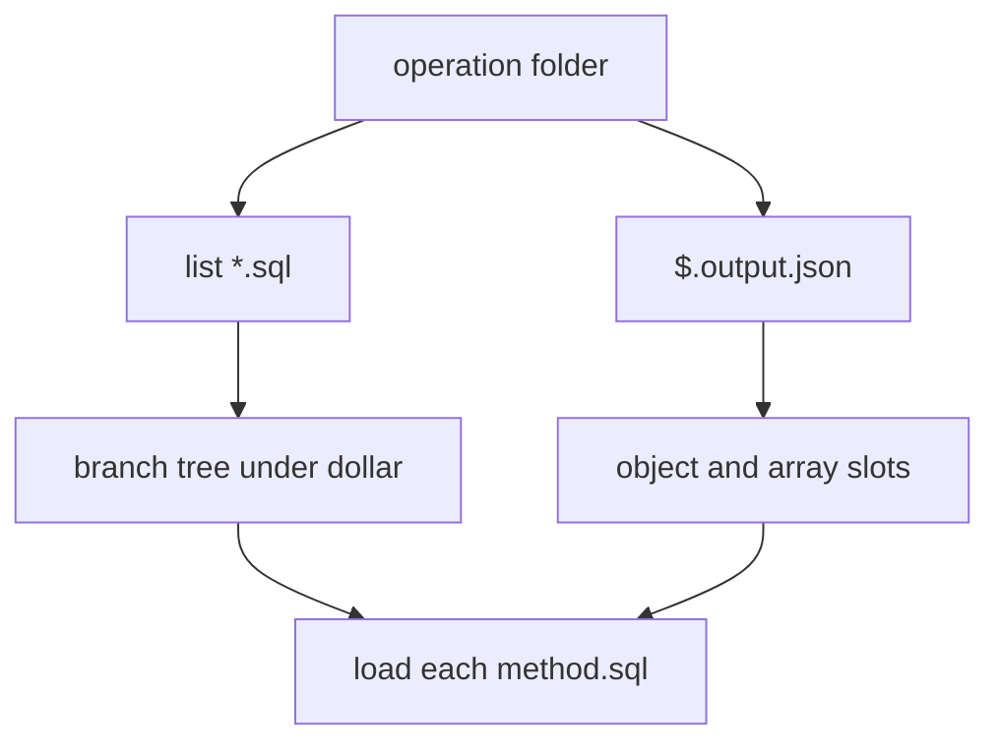

# Branches, twigs, and output

An operation folder becomes a small tree. SQL files define the tree. Output JSON shapes each node. Twigs are statements inside one file.

| Concept | Meaning |
|---|---|
| **Operation** | Folder under the API root, e.g. `user/get/` |
| **Trunk** | Root method `$`. File `$.sql` when present. Omitted when only sibling files exist. |
| **Branch** | Nested method under `$`, e.g. `$.paging` from `$.paging.sql` |
| **Twig** | One statement inside a file, split by `--sql--` or `--sql(connection)--` |

## How files and output meet

1. List every `*.sql`. At least one is required.
2. Strip `.sql`. Names look like `$`, `$.paging`, `$.roles`. Deeper dots are allowed (`$.data.items`).
3. Build the branch tree under `$`.
4. Load `$.output.json` (or `$.output.<mapper>.json`). The matching object or array property is that branch’s model.
5. Object and array properties also open child slots. That is how `parent_rows` works with no child SQL file. File-derived children missing from the map are merged in.
6. Nested child SQL is `$.{property}.sql` for property `property`. Output does not invent filenames.

| Pattern | Files | Output role |
|---|---|---|
| Trunk + shape | `$.sql` + `$.output.json` | Root type and properties shape the trunk |
| Nested child SQL | `$.sql` + `$.roles.sql` | Property `roles` matches the file suffix |
| `parent_rows` only | `$.sql` + `$.output.json` | Property `roles` with `parent_rows: true` |
| Sibling branches | `$.paging.sql` + `$.data.sql` | Properties `paging` and `data` |

Call path = folder path: `user/page`.

Twigs in one file share args and payload. Values that must move from an earlier statement to a later one go through `$params` (`$mode=params`) or through `$last_inserted_id` after a write. See [Parameter namespaces](parameter-namespaces.md).
