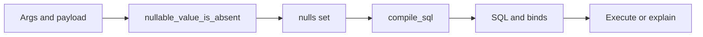

# Compile and elision

Parse builds a token list. Compile turns that list plus **this request’s values** into SQL and binds. Explain uses the same compile path and does not execute.

## What counts as absent

`nullable_value_is_absent` (in the executor, before compile) treats a value as absent when:

| Type | Absent |
|---|---|
| any | `null` or omitted |
| array (`integer[]`, …) | `[]` |
| `blob` | `null`, `[]`, `""`, `"[]"` |
| scalar | not absent when `0`, `""`, or `false` |

A header default is applied when the caller omits the name, so the value is **present**. `optional(...)` keeps that filter. `sort()` / `dir()` resolve with the default instead of eliding.

## The nulls set

Every name listed on a twig’s `nullable` list is checked. Absent names go into the nulls set passed to `compile_sql`. A parenthesized optional group is dropped when `_nullable_group_should_elide` says so:

- `optional_when`: an absent **condition** drops the block before the body is judged.
- `optional_groups_*`: an absent blob drops the group.
- multi-param `optional`: all absent → drop; none absent → keep; some absent → error (`partial parameters`).

A preceding `AND` or `OR` is stripped with the group.

## Clause cleanup

If elision leaves `WHERE`, `PREWHERE`, or `HAVING` empty, or leaves only `1 = 1`, that clause is removed. The same cleanup runs when the author wrote `WHERE 1 = 1 AND …` and the rest was removed. Each filter clause is cleaned on its own. A following `)` or `ORDER BY` does not leave a bare `WHERE`.

## What compile also does

- Expands one array parameter into `?, ?, ?` using the runtime length. A required empty list is an error. Inside `optional`, `[]` already counted as absent, so the block is gone before expansion.
- Repeats an optional-group body once per blob row and joins with `OR` or `AND`.
- Splices allowlisted `sort()` / `dir()` text. Unknown keys are a soft error, not injected SQL.

## Cache

Compiled SQL is cached for the duration of a trunk execution, keyed by the twig, the nulls set, the placeholder character, sort resolution, array lengths, and group shapes. A different arg combination is a different cache entry. Precompiled tokens do not include this step: elision still runs per request.

Twigs with `has_sort_dir: false` skip sort resolution.

See [Optional semantics](optional-semantics.md) for the all-or-nothing rules, and [Explain and debug](../guides/explain-and-debug.md) to inspect the SQL.
