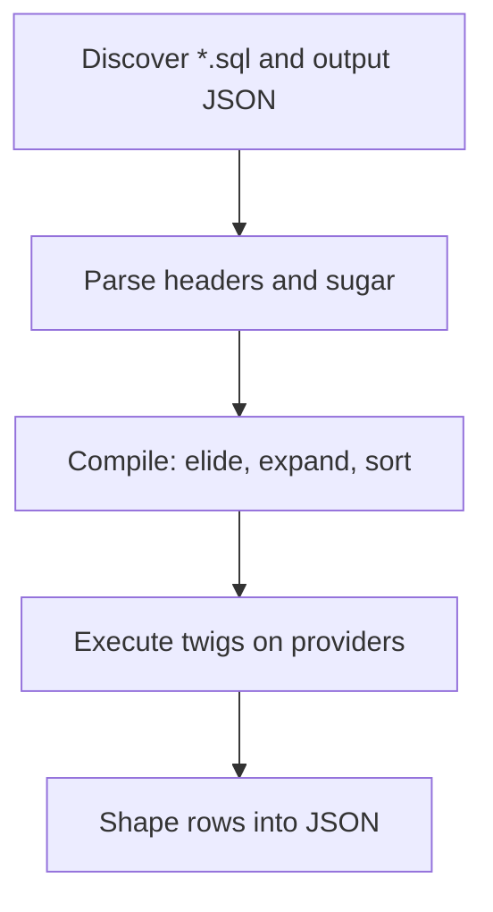

# Descriptor lifecycle

A call such as `yaal query user/get --arg id=1` crosses five stages. Compile is per request. Discovery and parse are per process unless you pass `--debug`.

## Discover

The API root is a directory. An operation is a folder path (`user/get`). Yaal lists `*.sql` in that folder. At least one SQL file is required. `$.output.json` (or `$.output.<mapper>.json`) supplies the shape. Output JSON does not invent SQL filenames.

## Parse

The parameter header is the input model. `optional(...)`, `optional_when(...)`, `optional_groups_or/and(...)`, and `sort()` / `dir()` are desugared into tokens with metadata (`nullable_parameters`, group fields, allowlisted expressions). Parse errors are raised: unknown types, nested groups, a group body with no row field.

Precompile stores this token form so runtime can skip lexing. See [Precompiled artifacts](../reference/precompiled-artifacts.md).

## Compile

Runtime values decide which optional groups are absent. `compile_sql` rewrites the token list into SQL text and a bind list. This stage also expands array `IN` placeholders and splices `sort()` / `dir()`. Details: [Compile and elision](compile-and-elision.md).

## Execute

Twigs run in order on the named provider (`"db"` unless `--sql(name)--` says otherwise). `$mode` rows can stash `$params`, return a soft error, break early, or pass through engine JSON. Ordinary rows are kept for shaping.

## Shape

`mapped` copies columns. `partition_by` collapses fan-out. `parent_rows` nests from the parent row set. Child SQL results are stitched by the parent’s partition key. See [Shaping strategies](shaping-strategies.md).

Invalid args fail **before** execute, as a soft `{"errors": [...]}` result, not as a raised exception. Compile failures such as partial optional parameters are raised while building the statement.
