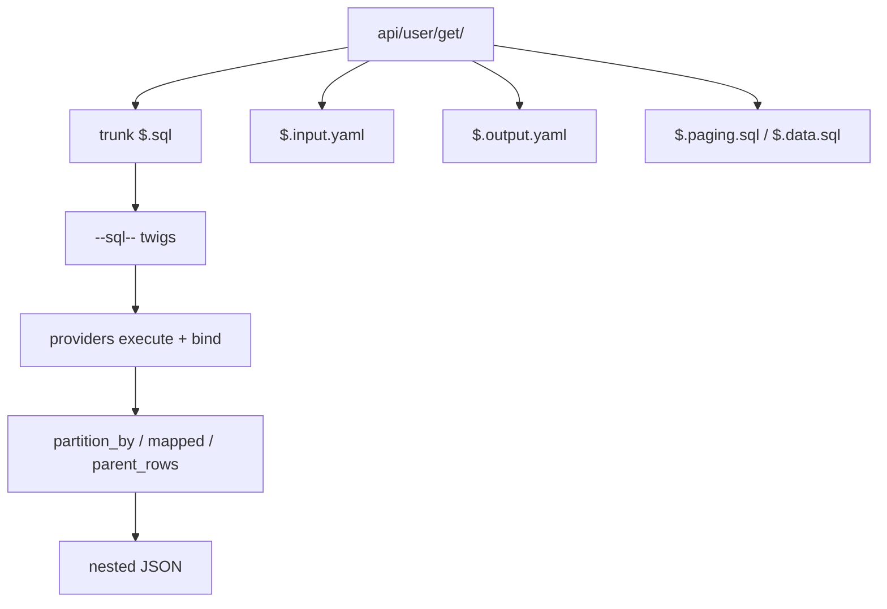

# Yaal descriptors

Yaal operations are folders of SQL + YAML. You call them by path (`user/get`); Yaal binds parameters, runs queries, and reshapes flat rows into nested JSON.

For full fixture walkthroughs (SQL + YAML + sample JSON + CLI/Python/C#), see [examples.md](examples.md).



## Trunk, branch, twig

| Concept | Meaning |
|---|---|
| **Operation** | Folder under the API root, e.g. `user/get/` |
| **Trunk** | Root of the descriptor; SQL file `$` → `$.sql`, or a trunk with only child SQL files |
| **Branch** | Nested SQL file `$.paging.sql`, `$.data.sql` → methods `$.paging`, `$.data`, nested under the trunk |
| **Twig** | One executable statement inside a SQL file, split by `--sql--` (or `--sql(connection)--`) |

File naming:

```text
api/user/get/
  $.sql                 # trunk twigs
  $.input.yaml          # args + payload schemas
  $.output.yaml         # default output shape
  $.output.cached.yaml  # alternate shape (output_mapper="cached")

api/user/page/
  $.paging.sql          # branch: paging metadata
  $.data.sql            # branch: page of rows
  $.input.yaml
  $.output.yaml
```

Call path is the folder path: `y.query("user/page", args={"page": 1, "page_size": 10})`.

## Parameters

Declare types at the top of a SQL file, bind with `{{...}}`:

```sql
--($args.id integer, name string)--

select *
from users u
where optional(u.user_id = {{$args.id}})
  and u.user_name = {{name}}
```

| Prefix | Source |
|---|---|
| `$args.*` | Operation args (`query(..., args=...)`) |
| bare name | Payload fields (`query(..., payload=...)`) |
| `$params.*` | Run-scoped bag (`$run_id`, `$last_inserted_id`, values from `$action=params`) |
| `$parent.*` | Parent branch payload (nested branches) |

### Optional filters

When a parameter is null, Yaal elides optional groups:

```sql
and optional(u.user_id = {{$args.id}})
```

Long form still works: `({{param}} is null or col = {{param}})` (including a preceding `AND`/`OR`). If that group is the only predicate, it becomes `1 = 1`.

## Output shaping

```yaml
type: object
partition_by: user_id
properties:
  id:
    mapped: user_id
  name:
    mapped: user_name
  roles:
    type: array
    partition_by: role_id
    parent_rows: true
    properties:
      id:
        mapped: role_id
      name:
        mapped: role_name
```

- `mapped` — SQL column → JSON field
- `partition_by` — collapse join fan-out into nested objects/arrays
- `parent_rows: true` — nest from parent rows without a child SQL file (parent must set `partition_by`)
- Root `type: object` vs `array` controls whether the result is one object or a list

## Multi-twig writes

One SQL file can run several statements. Example: [`tests/fixtures/api/user/create/`](../tests/fixtures/api/user/create/) inserts a user, assigns a role, then selects the shaped result:

```sql
--(id integer, name string)--

INSERT INTO users (user_id, user_name, active) VALUES ({{id}}, {{name}}, 1)

--sql--

INSERT INTO user_roles (user_id, role_id) VALUES ({{id}}, 2)

--sql--

SELECT ... WHERE u.user_id = {{id}}
```

After each twig, providers set `$params.$last_inserted_id` (engine-specific). Prefer an explicit payload/args id when you need a stable key across twigs; use `$last_inserted_id` when the engine’s last-insert semantics match your schema.

Named connections: `--sql(other)--` uses a provider registered as `"other"` (default connection name is `"db"`).

## Multi-file branches

Example: [`tests/fixtures/api/user/page/`](../tests/fixtures/api/user/page/) — trunk has no `$.sql`; `$.paging.sql` and `$.data.sql` become nested properties `paging` and `data` on the output object.

Branch names in `$.output.yaml` should match the SQL file suffixes (`paging`, `data`).

When combining `LIMIT`/`OFFSET` with join fan-out + `parent_rows`, page the parent entity in a subquery first (see `$.data.sql` in `user/page`); otherwise the limit truncates join rows and nests incomplete children.

## `$action` rows

If the first column set of a twig result includes `$action`, Yaal treats the row specially:

| `$action` | Effect |
|---|---|
| `params` | Copy columns onto `$params` (for later twigs/branches); continue |
| `error` | Stop and return `{"errors": [...]}` |
| `break` | Return these rows as the branch result (minus `$action`) |
| `json` | Parse/return the `json` column as the branch result |

Useful for paging totals:

```sql
SELECT 'params' AS "$action", COUNT(*) AS total_count FROM users
```

Guard a page number (soft error):

```sql
SELECT
    'error' AS "$action",
    1 AS code,
    'page out of range' AS message
WHERE {{$args.page}} < 1 OR {{$args.page}} > {{$params.total_pages}}
```

## Optional filter elision (explain)

With `and optional(u.active = {{$args.active}})`:

| Call | Compiled SQL |
|---|---|
| `args={"active": 1}` | `and (u.active = ?)` · binds `[1]` |
| `args` omitted / `active` null | The `and optional(...)` clause is removed entirely · binds `[]` |

```bash
yaal explain user/list --arg active=1
yaal explain user/list
```

## Cache and `output_mapper`

- `cache: true` on an output model caches that branch’s row set for the request (by SQL method). Cannot combine with `parent_rows` on the **same** branch.
- Alternate shapes: `$.output.<name>.yaml` selected with `output_mapper`:

```python
y.query("user/get", args={"id": 1}, output_mapper="cached")
# loads $.output.cached.yaml
```

See [`tests/fixtures/api/user/get/$.output.cached.yaml`](../tests/fixtures/api/user/get/$.output.cached.yaml).

## Errors

**Raised exceptions** (configuration / I/O):

| Type | When |
|---|---|
| `DescriptorNotFoundError` | Path has no SQL files / cannot build |
| `UnsupportedDatabaseUrlError` | Unknown URL scheme |
| `PathEscapeError` | Descriptor path escapes the API root |
| `YaalError` | Base class for the above |

**Soft validation** (not raised): invalid `args` / `payload` against `$.input.yaml` returns:

```json
{"errors": [{"message": "..."}]}
```

Callers should check for an `errors` key. `$action=error` rows use the same soft shape.

## Dual-port JSON Schema subset

Python validates with **JSON Schema Draft-4**; C# uses Json.Schema **2020-12**. Keep input models on the common subset:

- `type`, `properties`, `required`
- Simple scalar types: `string`, `integer`, `number`, `boolean`, `object`, `array`

Avoid dialect-specific keywords (`$ref` graphs, `unevaluatedProperties`, draft-dependent `additionalProperties` defaults) if both ports must accept the same fixtures.

## Public API (Python)

```python
from yaal import Yaal

y = Yaal("path/to/api", debug=True)
y.setup_data_provider("db", "sqlite3:////tmp/app.db")

y.query("user/get", args={"id": 1})
y.query_json("user/get", args={"id": 1})
y.explain_sql("user/get", args={"id": 1})
y.query("user/get", args={"id": 1}, output_mapper="cached")
y.clear_cache()
```

`debug=True` disables descriptor caching (reload SQL/YAML each call). It is not a log level.

C# mirrors the same surface (`Query`, `QueryJson`, `ExplainSql`, `SetupDataProvider`, `outputMapper`).
