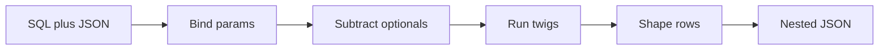

# Yaal

Yaal is a **subtractive SQL ORM**. You write SQL and a JSON shape. At bind time Yaal removes unused `optional(...)` filters, runs the remaining statements (optionally across named databases), and shapes flat rows into nested JSON.



SQL stays the source of truth. Aggregations, `WITH`, and window functions are ordinary SQL, not a query-builder escape hatch. Yaal is not ActiveRecord: there is no entity tracking, migration ownership, or query-builder DSL.

Shared fixtures live under `tests/fixtures/api/`. Seed data is `docker/sqlite/schema.sql`. Python and .NET 8 share those descriptors. Runtime APIs are in the [appendices](appendix/python.md).

## Where to start

| If you want to… | Go to |
|---|---|
| Run something in the next few minutes | [Tutorial](tutorial/index.md) |
| Do a specific task (filters, paging, precompile) | [Guides](guides/index.md) |
| Understand why a rule exists | [Concepts](concepts/index.md) |
| Look up syntax while writing SQL | [Reference](reference/index.md) |
| See which fixture shows what | [Fixture index](cookbook/fixtures.md) |

```bash
make install
make docs-serve
make example
```

Preview this site locally with `make docs-serve` after `make docs-install`.
